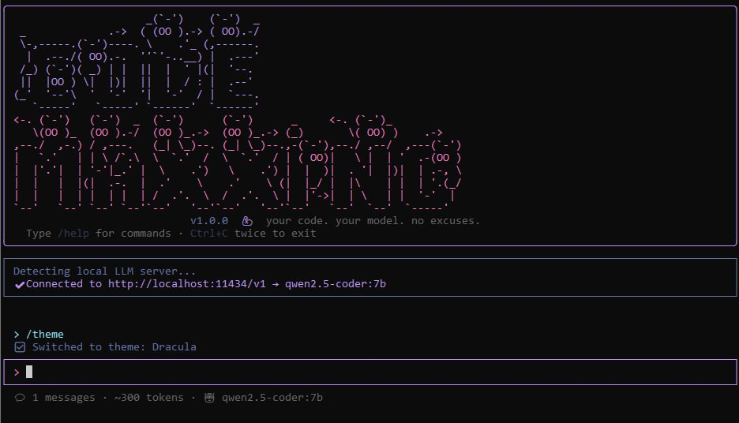

# codemaxxing 💪

> your code. your model. no excuses.

<p align="center">
  
</p>

Open-source terminal coding agent. Connect **any** LLM — local or remote — and start building. Like Claude Code, but you bring your own model.

## Why?

Every coding agent locks you into their API. Codemaxxing doesn't. Run it with LM Studio, Ollama, OpenRouter, OpenAI, or any OpenAI-compatible endpoint. Your machine, your model, your rules.

## Install

**If you have Node.js:**
```bash
npm install -g codemaxxing
```

**If you don't have Node.js:**

The one-line installers below will install Node.js first, then codemaxxing.

*Linux / macOS:*
```bash
bash -c "$(curl -fsSL https://raw.githubusercontent.com/MarcosV6/codemaxxing/main/install.sh)"
```

*Windows (CMD as Administrator):*
```
curl -fsSL -o %TEMP%\install-codemaxxing.bat https://raw.githubusercontent.com/MarcosV6/codemaxxing/main/install.bat && %TEMP%\install-codemaxxing.bat
```

*Windows (PowerShell as Administrator):*
```powershell
curl -fsSL -o $env:TEMP\install-codemaxxing.bat https://raw.githubusercontent.com/MarcosV6/codemaxxing/main/install.bat; & $env:TEMP\install-codemaxxing.bat
```

> **Windows note:** If Node.js was just installed, you may need to close and reopen your terminal, then run `npm install -g codemaxxing` manually. This is a Windows PATH limitation.

## Updating

```bash
npm update -g codemaxxing
```

If that doesn't get the latest version:
```bash
npm install -g codemaxxing@latest
```

## Quick Start

### 1. Start Your LLM

You need a local LLM server running. The easiest option:

1. Download [LM Studio](https://lmstudio.ai)
2. Search for a model (e.g. **Qwen 2.5 Coder 7B Q4_K_M** — good for testing)
3. Load the model
4. Click **Start Server** (it runs on port 1234 by default)

### 2. Run It

```bash
codemaxxing
```

That's it. Codemaxxing auto-detects LM Studio and connects. Start coding.

---

## Authentication

**One command to connect any provider:**

```bash
codemaxxing login
```

Interactive setup walks you through it. Or use `/login` inside the TUI.

**Supported auth methods:**

| Provider | Methods |
|----------|---------|
| **OpenRouter** | OAuth (browser login) or API key — one login, 200+ models |
| **Anthropic** | Link your Claude subscription (via Claude Code) or API key |
| **OpenAI** | Import from Codex CLI or API key |
| **Qwen** | Import from Qwen CLI or API key |
| **GitHub Copilot** | Device flow (browser) |
| **Google Gemini** | API key |
| **Any provider** | API key + custom base URL |

```bash
codemaxxing login              # Interactive provider picker
codemaxxing auth list          # See saved credentials
codemaxxing auth remove <name> # Delete a credential
codemaxxing auth openrouter    # Direct OpenRouter OAuth
```

Credentials stored securely in `~/.codemaxxing/auth.json` (owner-only permissions).

---

## Advanced Setup

**With a remote provider (OpenAI, OpenRouter, etc.):**

```bash
codemaxxing --base-url https://api.openai.com/v1 --api-key sk-... --model gpt-4o
```

**With a saved provider profile:**

```bash
codemaxxing --provider openrouter
```

**Auto-detected local servers:** LM Studio (`:1234`), Ollama (`:11434`), vLLM (`:8000`)

## Features

### 🔥 Streaming Tokens
Real-time token display. See the model think, not just the final answer.

### ⚠️ Tool Approval + Diff Preview
Dangerous operations require your approval. File writes show a **unified diff** of what will change before you say yes. Press `y` to allow, `n` to deny, `a` to always allow.

### 🏗️ Architect Mode
Dual-model planning. A "planner" model reasons through the approach, then your editor model executes the changes.
- `/architect` — toggle on/off
- `/architect claude-3-5-sonnet` — set the planner model
- Great for pairing expensive reasoning models with fast editors

### 🧠 Skills System (21 Built-In)
Downloadable skill packs that teach the agent domain expertise. Ships with 21 built-in skills:

**Frontend:** react-expert, nextjs-app, tailwind-ui, svelte-kit
**Mobile:** react-native, swift-ios, flutter
**Backend:** python-pro, node-backend, go-backend, rust-systems
**Data:** sql-master, supabase
**Practices:** typescript-strict, api-designer, test-engineer, doc-writer, security-audit, devops-toolkit, git-workflow
**Game Dev:** unity-csharp

```
/skills              # Browse & install from registry
/skills install X    # Quick install
/skills on/off X     # Toggle per session
```

Project-level config: add `.codemaxxing/skills.json` to scope skills per project.

### 📋 CODEMAXXING.md — Project Rules
Drop a `CODEMAXXING.md` in your project root for project-specific instructions. Auto-loaded every session. Also supports `.cursorrules` for Cursor migrants.

### 🔧 Auto-Lint
Automatically runs your linter after every file edit and feeds errors back to the model for auto-fix. Detects eslint, biome, ruff, clippy, golangci-lint, and more.
- `/lint on` / `/lint off` — toggle (ON by default)

### 📂 Smart Context (Repo Map)
Scans your codebase and builds a map of functions, classes, and types. The model knows what exists where without reading every file.

### 📦 Context Compression
When conversation history exceeds 80k tokens, older messages are automatically summarized to free up context. Configurable via `contextCompressionThreshold`.

### 💰 Cost Tracking
Per-session token usage and estimated cost in the status bar. Pricing for 20+ common models. Saved to session history.

### 🖥️ Headless/CI Mode
Run codemaxxing in scripts and pipelines without the TUI:
```bash
codemaxxing exec "add error handling to api.ts"
codemaxxing exec --auto-approve "fix all lint errors"
echo "add tests" | codemaxxing exec
```

### 🔀 Git Integration
Opt-in git commands built in:
- `/commit <message>` — stage all + commit
- `/push` — push to remote
- `/diff` — show changes
- `/undo` — revert last codemaxxing commit
- `/git on` / `/git off` — toggle auto-commits

### 💾 Session Persistence
Conversations auto-save to SQLite. Pick up where you left off:
- `/sessions` — list past sessions
- `/session delete` — remove a session
- `/resume` — interactive session picker

### 🔌 MCP Support (Model Context Protocol)
Connect to external tools via the industry-standard MCP protocol. Databases, GitHub, Slack, browsers — anything with an MCP server.
- Compatible with `.cursor/mcp.json` and `opencode.json` configs
- `/mcp` — show connected servers
- `/mcp add github npx -y @modelcontextprotocol/server-github` — add a server
- `/mcp tools` — list all available MCP tools

### 🖥️ Zero-Setup Local LLM
First time with no LLM? Codemaxxing walks you through it:
1. Detects your hardware (CPU, RAM, GPU)
2. Recommends coding models that fit your machine
3. Installs Ollama automatically
4. Downloads the model with a progress bar
5. Connects and drops you into coding mode

No googling, no config files, no decisions. Just run `codemaxxing`.

### 🦙 Ollama Management
Full Ollama control from inside codemaxxing:
- `/ollama` — status, installed models, GPU usage
- `/ollama pull` — interactive model picker + download
- `/ollama delete` — pick and remove models
- `/ollama start` / `/ollama stop` — server management
- Exit warning when Ollama is using GPU memory

### 🔄 Multi-Provider
Switch models mid-session with an interactive picker:
- `/model` — browse and switch models
- `/model gpt-4o` — switch directly by name
- Native Anthropic API support (not just OpenAI-compatible)

### 🎨 14 Themes
`/theme` to browse: cyberpunk-neon, dracula, gruvbox, nord, catppuccin, tokyo-night, one-dark, rosé-pine, synthwave, blood-moon, mono, solarized, hacker, acid

### 🔐 Authentication
One command to connect any LLM provider. OpenRouter OAuth, Anthropic subscription linking, Codex/Qwen CLI import, GitHub Copilot device flow, or manual API keys.

### 📋 Smart Paste
Multi-line pastes collapse into `[Pasted text #1 +N lines]` badges.

### ⌨️ Slash Commands
Type `/` for autocomplete suggestions. Arrow keys to navigate, Tab or Enter to select.

## Commands

| Command | Description |
|---------|-------------|
| `/help` | Show all commands |
| `/connect` | Retry LLM connection |
| `/login` | Interactive auth setup |
| `/model` | Browse & switch models (picker) |
| `/architect` | Toggle architect mode / set model |
| `/skills` | Browse, install, manage skills |
| `/lint on/off` | Toggle auto-linting |
| `/mcp` | MCP server status & tools |
| `/ollama` | Ollama status, models & GPU |
| `/ollama pull` | Download a model (picker) |
| `/ollama delete` | Remove a model (picker) |
| `/ollama start/stop` | Server management |
| `/theme` | Switch color theme |
| `/map` | Show repository map |
| `/sessions` | List past sessions |
| `/session delete` | Delete a session |
| `/resume` | Resume a past session |
| `/reset` | Clear conversation |
| `/context` | Show message count + tokens |
| `/diff` | Show git changes |
| `/commit <msg>` | Stage all + commit |
| `/push` | Push to remote |
| `/undo` | Revert last codemaxxing commit |
| `/git on/off` | Toggle auto-commits |
| `/quit` | Exit |

## CLI

```bash
codemaxxing                          # Start TUI
codemaxxing login                    # Auth setup
codemaxxing auth list                # Show saved credentials
codemaxxing exec "prompt"            # Headless mode (no TUI)
codemaxxing exec --auto-approve "x"  # Skip approval prompts
codemaxxing exec --json "x"          # JSON output for scripts
echo "fix tests" | codemaxxing exec  # Pipe from stdin
```

```
-m, --model <model>       Model name to use
-p, --provider <name>     Provider profile from config
-k, --api-key <key>       API key for the provider
-u, --base-url <url>      Base URL for the provider API
-h, --help                Show help
```

## Config

Settings are stored in `~/.codemaxxing/settings.json`:

```json
{
  "provider": {
    "baseUrl": "http://localhost:1234/v1",
    "apiKey": "not-needed",
    "model": "auto"
  },
  "providers": {
    "local": {
      "name": "Local (LM Studio/Ollama)",
      "baseUrl": "http://localhost:1234/v1",
      "apiKey": "not-needed",
      "model": "auto"
    },
    "openrouter": {
      "name": "OpenRouter",
      "baseUrl": "https://openrouter.ai/api/v1",
      "apiKey": "sk-or-...",
      "model": "anthropic/claude-sonnet-4"
    },
    "openai": {
      "name": "OpenAI",
      "baseUrl": "https://api.openai.com/v1",
      "apiKey": "sk-...",
      "model": "gpt-4o"
    }
  },
  "defaults": {
    "autoApprove": false,
    "maxTokens": 8192
  }
}
```

## Tools

Built-in tools:

- **read_file** — Read file contents (safe)
- **write_file** — Write/create files (requires approval, shows diff)
- **list_files** — List directory contents (safe)
- **search_files** — Search for patterns across files (safe)
- **run_command** — Execute shell commands (requires approval)

Plus any tools from connected MCP servers (databases, APIs, GitHub, etc.)

## Project Context

Drop a `CODEMAXXING.md` file in your project root to give the model extra context about your codebase, conventions, or instructions. It's automatically included in the system prompt.

## Stack

- **Runtime:** Node.js + TypeScript
- **TUI:** [Ink](https://github.com/vadimdemedes/ink) (React for the terminal)
- **LLM SDKs:** [OpenAI SDK](https://github.com/openai/openai-node) + [Anthropic SDK](https://github.com/anthropics/anthropic-sdk-typescript)
- **MCP:** [@modelcontextprotocol/sdk](https://github.com/modelcontextprotocol/typescript-sdk)
- **Sessions:** [better-sqlite3](https://github.com/WiseLibs/better-sqlite3)
- **Local LLM:** Ollama integration (auto-install, pull, manage)
- **Zero cloud dependencies** — everything runs locally

## Inspired By

Built by studying the best:
- [Aider](https://github.com/paul-gauthier/aider) — repo map concept, auto-commit
- [Claude Code](https://docs.anthropic.com/en/docs/claude-code) — permission system, paste handling
- [OpenCode](https://github.com/opencode-ai/opencode) — multi-provider, SQLite sessions

## License

MIT
